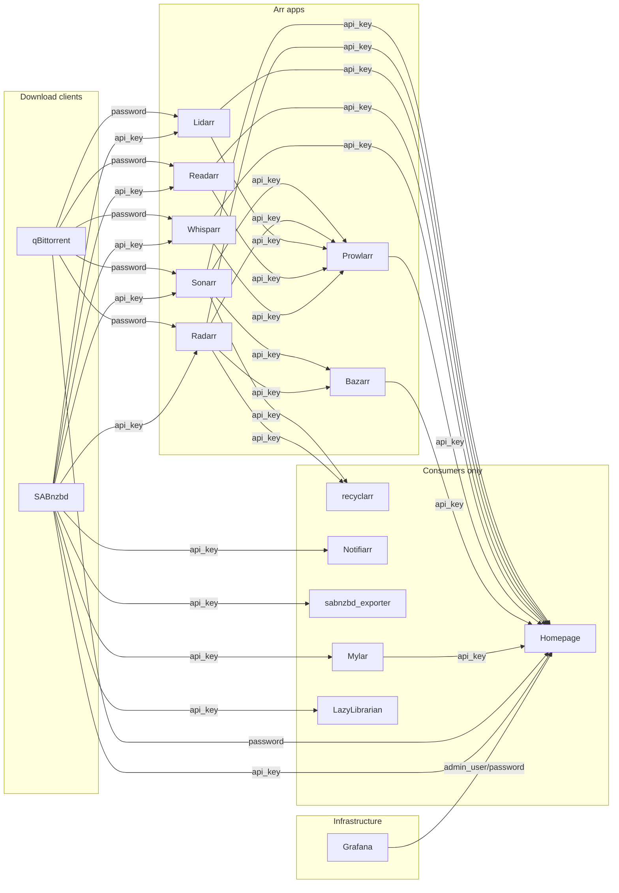

# Credential Dependencies

This document maps how credentials flow between services in the arr media stack. It answers:
which service produces a credential, which services consume it, where each credential is
stored, and in what format. Use this as a reference when rotating credentials manually or
with the rotation scripts.

## Credential flow graph

Each arrow is labelled with the credential type. Nodes are grouped by role: **arr apps**
(blue), **support services** (green), **infrastructure** (orange), **consumers only** (grey).



## Credential flow matrix

Rows are producers. Columns are consumers. A cell contains the credential type that the
producer exposes and the consumer uses.

```text
Producer \ Consumer  | Prowlarr | Bazarr | recyclarr | Sonarr | Radarr | Lidarr | Readarr | Whisparr | Mylar | LazyLibrarian | Notifiarr | Exporter | Homepage
---------------------|----------|--------|-----------|--------|--------|--------|---------|----------|-------|---------------|-----------|----------|---------
Sonarr               | api_key  | api_key| api_key   |        |        |        |         |          |       |               |           |          | api_key
Radarr               | api_key  | api_key| api_key   |        |        |        |         |          |       |               |           |          | api_key
Lidarr               | api_key  |        |           |        |        |        |         |          |       |               |           |          | api_key
Readarr              | api_key  |        |           |        |        |        |         |          |       |               |           |          | api_key
Whisparr             | api_key  |        |           |        |        |        |         |          |       |               |           |          | api_key
Prowlarr             |          |        |           |        |        |        |         |          |       |               |           |          | api_key
Bazarr               |          |        |           |        |        |        |         |          |       |               |           |          | api_key
Mylar                |          |        |           |        |        |        |         |          |       |               |           |          | api_key
qBittorrent          |          |        |           | password| password| password| password| password |       |               |           |          | password
SABnzbd              |          |        |           | api_key | api_key | api_key | api_key | api_key  | api_key/password | api_key/password | api_key | api_key | api_key
Grafana              |          |        |           |         |         |         |         |          |       |               |           |          | admin_user/password
```

## Per-service credential detail

**Sonarr**

- Produces: API key (see `configs/sonarr/config/config.xml` `<ApiKey>`)
- Consumed by: Prowlarr (Applications table, id=3), Bazarr (config.yaml `sonarr.apikey`),
  recyclarr (secrets.yml `sonarr_apikey`), Homepage (`HOMEPAGE_VAR_SONARR_API_KEY`)
- Consumes: qBittorrent password and SABnzbd API key/password (stored in DownloadClients
  table of sonarr.db)

**Radarr**

- Produces: API key (see `configs/radarr/config/config.xml` `<ApiKey>`)
- Consumed by: Prowlarr (Applications table, id=5), Bazarr (config.yaml `radarr.apikey`),
  recyclarr (secrets.yml `radarr_apikey`), Homepage (`HOMEPAGE_VAR_RADARR_API_KEY`)
- Consumes: qBittorrent password and SABnzbd API key/password (stored in DownloadClients
  table of radarr.db)

**Lidarr**

- Produces: API key (see `configs/lidarr/config/config.xml` `<ApiKey>`)
- Consumed by: Prowlarr (Applications table, id=1), Homepage (`HOMEPAGE_VAR_LIDARR_API_KEY`)
- Consumes: qBittorrent password and SABnzbd API key/password (stored in DownloadClients
  table of lidarr.db)

**Readarr**

- Produces: API key (see `configs/readarr/config/config.xml` `<ApiKey>`)
- Consumed by: Prowlarr (Applications table, id=2), Homepage (`HOMEPAGE_VAR_READARR_API_KEY`)
- Consumes: qBittorrent password and SABnzbd API key/password (stored in DownloadClients
  table of readarr.db)

**Whisparr**

- Produces: API key (see `configs/whisparr/config/config.xml` `<ApiKey>`)
- Consumed by: Prowlarr (Applications table, id=7), Homepage (`HOMEPAGE_VAR_WHISPARR_API_KEY`)
- Consumes: qBittorrent password and SABnzbd API key/password (stored in DownloadClients
  table of whisparr3.db)

**Prowlarr**

- Produces: API key (see `configs/prowlarr/config/config.xml` `<ApiKey>`)
- Consumed by: Homepage (`configs/homepage/.env` `HOMEPAGE_VAR_PROWLARR_API_KEY`)
- Consumes: API keys of Sonarr, Radarr, Lidarr, Readarr, Whisparr (Applications table,
  Settings JSON field `apiKey`)

**Bazarr**

- Produces: API key (see `configs/bazarr/config/config/config.yaml` `auth.apikey`)
- Consumed by: Homepage (`configs/homepage/.env` `HOMEPAGE_VAR_BAZARR_API_KEY`)
- Consumes: Sonarr API key (config.yaml `sonarr.apikey`), Radarr API key (config.yaml
  `radarr.apikey`)

**qBittorrent**

- Produces: WebUI password (username `qbittorrent`, see DownloadClients table in any arr
  DB for current value)
- Consumed by: Sonarr, Radarr, Lidarr, Readarr, Whisparr (each app's DownloadClients table)
- Consumes: nothing from other services

**SABnzbd**

- Produces: API key, NZB key, and WebUI password (username `sabnzbd`, see
  `configs/sabnzbd/config/sabnzbd.ini`)
- Consumed by: Sonarr, Radarr, Lidarr, Readarr, Whisparr, Mylar, LazyLibrarian, Notifiarr,
  and `sabnzbd_exporter`
- Consumes: shared TLS certificate files from `certs/`

**Grafana**

- Produces: admin username/password (see `configs/grafana/config/grafana.ini` `[security]`)
- Consumed by: Homepage (`HOMEPAGE_VAR_GRAFANA_AUTH`) for the built-in Grafana widget
- Note: the Homepage Grafana widget calls `/api/admin/stats`, which requires Grafana
  server-admin access; a Grafana service account token is not sufficient for this endpoint.

## Credential storage locations

| Service       | Credential                | File path                                                       | Format                                              |
|---------------|---------------------------|-----------------------------------------------------------------|-----------------------------------------------------|
| Sonarr        | API key                   | `configs/sonarr/config/config.xml` (`<ApiKey>`)                 | plain text XML element                              |
| Radarr        | API key                   | `configs/radarr/config/config.xml` (`<ApiKey>`)                 | plain text XML element                              |
| Lidarr        | API key                   | `configs/lidarr/config/config.xml` (`<ApiKey>`)                 | plain text XML element                              |
| Readarr       | API key                   | `configs/readarr/config/config.xml` (`<ApiKey>`)                | plain text XML element                              |
| Whisparr      | API key                   | `configs/whisparr/config/config.xml` (`<ApiKey>`)               | plain text XML element                              |
| Prowlarr      | API key                   | `configs/prowlarr/config/config.xml` (`<ApiKey>`)               | plain text XML element                              |
| Prowlarr      | app API keys              | `configs/prowlarr/config/prowlarr.db` (Applications table)      | plain text JSON in Settings                         |
| Bazarr        | API key                   | `configs/bazarr/config/config/config.yaml` (`auth.apikey`)      | plain text YAML value                               |
| Bazarr        | login password            | `configs/bazarr/config/config/config.yaml` (`auth.password`)    | MD5 hash                                            |
| Bazarr        | sonarr API key            | `configs/bazarr/config/config/config.yaml` (`sonarr.apikey`)    | plain text YAML value                               |
| Bazarr        | radarr API key            | `configs/bazarr/config/config/config.yaml` (`radarr.apikey`)    | plain text YAML value                               |
| recyclarr     | sonarr API key            | `configs/recyclarr/config/secrets.yml` (`sonarr_apikey`)        | plain text YAML value                               |
| recyclarr     | radarr API key            | `configs/recyclarr/config/secrets.yml` (`radarr_apikey`)        | plain text YAML value                               |
| Sonarr        | login password            | `configs/sonarr/config/sonarr.db` (Users table)                 | PBKDF2-SHA512 hash                                  |
| Radarr        | login password            | `configs/radarr/config/radarr.db` (Users table)                 | PBKDF2-SHA512 hash                                  |
| Lidarr        | login password            | `configs/lidarr/config/lidarr.db` (Users table)                 | PBKDF2-SHA512 hash                                  |
| Readarr       | login password            | `configs/readarr/config/readarr.db` (Users table)               | PBKDF2-SHA512 hash                                  |
| Whisparr      | login password            | `configs/whisparr/config/whisparr.db` (Users table)             | PBKDF2-SHA512 hash                                  |
| Prowlarr      | login password            | `configs/prowlarr/config/prowlarr.db` (Users table)             | PBKDF2-SHA512 hash                                  |
| qBittorrent   | WebUI password            | `configs/qbittorrent/config/qBittorrent/qBittorrent.conf`       | PBKDF2 hash in WebUI section                        |
| SABnzbd       | API key                   | `configs/sabnzbd/config/sabnzbd.ini` (`misc.api_key`)           | plain text INI value                                |
| SABnzbd       | NZB key                   | `configs/sabnzbd/config/sabnzbd.ini` (`misc.nzb_key`)           | plain text INI value                                |
| SABnzbd       | login password            | `configs/sabnzbd/config/sabnzbd.ini` (`misc.password`)          | plain text INI value                                |
| SABnzbd       | exporter API key          | `configs/sabnzbd_exporter/.env` (`SABNZBD_APIKEYS`)             | plain text env value                                |
| Mylar         | SABnzbd creds             | `configs/mylar/config/mylar/config.ini` (`[SABnzbd]`)           | plain text INI values                               |
| LazyLibrarian | SABnzbd creds             | `configs/lazylibrarian/config/config.ini` (`[SABNZBD]`)         | plain text INI values                               |
| Notifiarr     | SABnzbd API key           | `configs/notifiarr/config/notifiarr.conf` (`[[sabnzbd]]`)       | plain text TOML value                               |
| Sonarr        | qbt password              | `configs/sonarr/config/sonarr.db` (DownloadClients table)       | plain text JSON in Settings                         |
| Radarr        | qbt password              | `configs/radarr/config/radarr.db` (DownloadClients table)       | plain text JSON in Settings                         |
| Lidarr        | qbt password              | `configs/lidarr/config/lidarr.db` (DownloadClients table)       | plain text JSON in Settings                         |
| Readarr       | qbt password              | `configs/readarr/config/readarr.db` (DownloadClients table)     | plain text JSON in Settings                         |
| Whisparr      | qbt password              | `configs/whisparr/config/whisparr3.db` (DownloadClients table)  | plain text JSON in Settings                         |
| Sonarr        | SABnzbd API key/password  | `configs/sonarr/config/sonarr.db` (DownloadClients table)       | plain text JSON in Settings                         |
| Radarr        | SABnzbd API key/password  | `configs/radarr/config/radarr.db` (DownloadClients table)       | plain text JSON in Settings                         |
| Lidarr        | SABnzbd API key/password  | `configs/lidarr/config/lidarr.db` (DownloadClients table)       | plain text JSON in Settings                         |
| Readarr       | SABnzbd API key/password  | `configs/readarr/config/readarr.db` (DownloadClients table)     | plain text JSON in Settings                         |
| Whisparr      | SABnzbd API key/password  | `configs/whisparr/config/whisparr3.db` (DownloadClients table)  | plain text JSON in Settings                         |
| Homepage      | Sonarr API key            | `configs/homepage/.env` (`HOMEPAGE_VAR_SONARR_API_KEY`)         | plain text env value                                |
| Homepage      | Radarr API key            | `configs/homepage/.env` (`HOMEPAGE_VAR_RADARR_API_KEY`)         | plain text env value                                |
| Homepage      | Lidarr API key            | `configs/homepage/.env` (`HOMEPAGE_VAR_LIDARR_API_KEY`)         | plain text env value                                |
| Homepage      | Readarr API key           | `configs/homepage/.env` (`HOMEPAGE_VAR_READARR_API_KEY`)        | plain text env value                                |
| Homepage      | Whisparr API key          | `configs/homepage/.env` (`HOMEPAGE_VAR_WHISPARR_API_KEY`)       | plain text env value                                |
| Homepage      | Prowlarr API key          | `configs/homepage/.env` (`HOMEPAGE_VAR_PROWLARR_API_KEY`)       | plain text env value                                |
| Homepage      | Bazarr API key            | `configs/homepage/.env` (`HOMEPAGE_VAR_BAZARR_API_KEY`)         | plain text env value                                |
| Homepage      | Mylar API key             | `configs/homepage/.env` (`HOMEPAGE_VAR_MYLAR_API_KEY`)          | plain text env value                                |
| Homepage      | SABnzbd API key           | `configs/homepage/.env` (`HOMEPAGE_VAR_SABNZBD_API_KEY`)        | plain text env value                                |
| Homepage      | qBittorrent password      | `configs/homepage/.env` (`HOMEPAGE_VAR_QBITTORRENT_PASS`)       | plain text env value                                |
| Homepage      | Jellyfin API key          | `configs/homepage/.env` (`HOMEPAGE_VAR_JELLYFIN_KEY`)           | plain text env value (create in Jellyfin Dashboard) |
| Homepage      | Audiobookshelf token      | `configs/homepage/.env` (`HOMEPAGE_VAR_AUDIOBOOKSHELF_API_KEY`) | JWT from `absdatabase.sqlite` `users.token`         |
| Grafana       | admin username            | `configs/grafana/config/grafana.ini` (`admin_user`)             | plain text INI value                                |
| Grafana       | admin password            | `configs/grafana/config/grafana.ini` (`admin_password`)         | plain text INI value                                |
| Homepage      | Grafana Basic auth header | `configs/homepage/.env` (`HOMEPAGE_VAR_GRAFANA_AUTH`)           | plain text env value                                |

**Homepage** (`rotate-api-keys.sh` auto-updates `HOMEPAGE_VAR_*` for all services it
rotates. Jellyfin and Audiobookshelf keys are out of scope for the rotation script and
must be managed manually.)

**Note:** The `<SslCertPassword>` field present in each arr `config.xml` is managed
exclusively by `make generate_certificate` and must not be touched by any rotation script.
